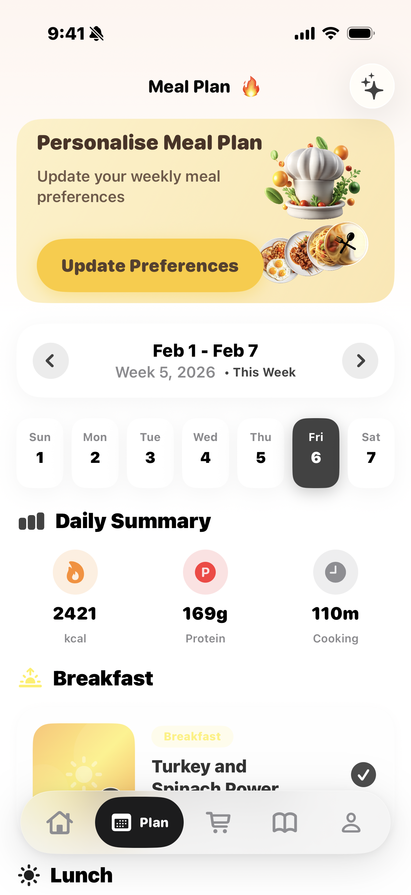
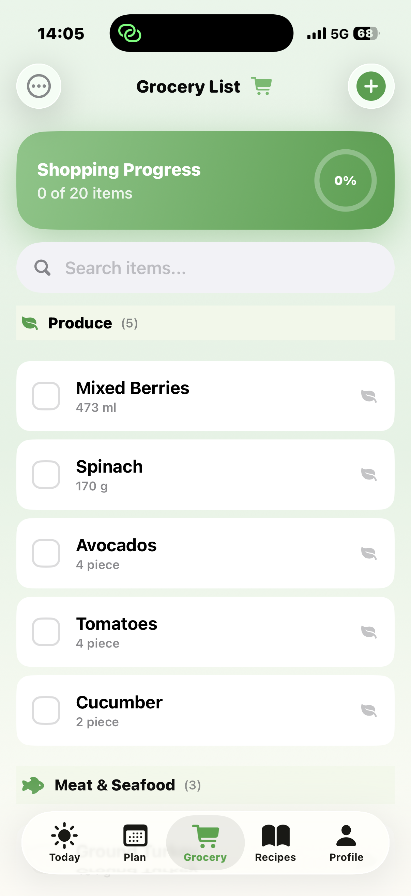
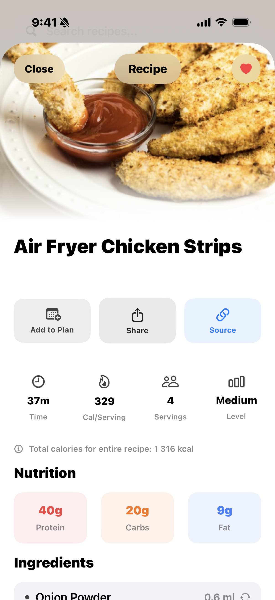
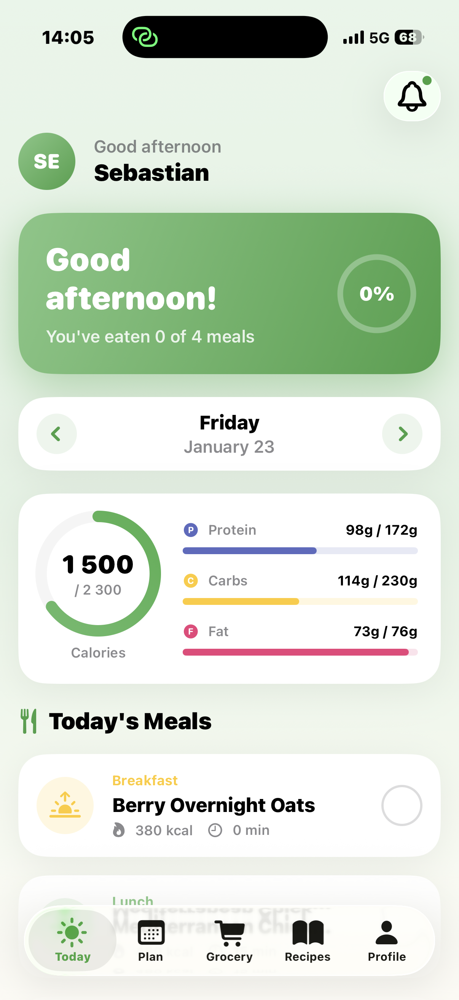

# MealPrepAI

**Your AI-powered meal planning assistant for iOS**

MealPrepAI is a modern iOS application that helps users plan their meals, track nutrition, and simplify grocery shopping. Built with SwiftUI and powered by AI, it creates personalized meal plans tailored to your dietary preferences, health goals, and cooking skills.

<p align="center">
  
  
  
  
</p>

## Features

### Personalized Meal Planning
- **AI-Generated Meal Plans** - Get weekly meal plans customized to your nutritional needs, dietary restrictions, and taste preferences
- **Smart Meal Swapping** - Don't like a suggested meal? Swap it for an alternative that fits your plan
- **Daily & Weekly Views** - Track your meals day-by-day or see the full week at a glance

### Nutrition Tracking
- **Calorie & Macro Goals** - Set personalized daily targets for calories, protein, carbs, and fat
- **Visual Progress Rings** - Beautiful circular progress indicators show your daily nutritional intake
- **Meal-by-Meal Breakdown** - See detailed nutrition info for every recipe

<p align="center">
  
  
</p>

### Recipe Library
- **Extensive Recipe Collection** - Browse recipes by category (breakfast, lunch, dinner, snacks)
- **Search & Filter** - Find recipes by cuisine, cooking time, or dietary restrictions
- **Favorites** - Save your favorite recipes for quick access
- **Detailed Instructions** - Step-by-step cooking instructions with ingredient lists

### Smart Grocery Lists
- **Auto-Generated Lists** - Grocery lists are automatically created from your meal plan
- **Organized by Category** - Items grouped by store section (produce, dairy, meat, etc.)
- **Shopping Progress** - Track items as you shop with checkboxes and progress indicators
- **Share & Export** - Share your grocery list or export it for easy shopping

### Personalization
- **Comprehensive Onboarding** - Set up your profile with dietary restrictions, allergies, cuisine preferences, and cooking skill level
- **Flexible Diets** - Support for vegetarian, vegan, keto, paleo, gluten-free, and more
- **Custom Allergies** - Add any allergies or intolerances, even those not in the predefined list
- **Cooking Preferences** - Filter recipes by prep time and complexity

## Technology Stack

### Core Frameworks
- **SwiftUI** - Modern declarative UI framework for iOS
- **SwiftData** - Apple's native data persistence framework for local storage
- **Swift Concurrency** - async/await for smooth, responsive user experience

### Architecture
- **MVVM Pattern** - Clean separation of concerns with ViewModels using `@Observable`
- **SwiftData Models** - 9 interconnected data models with cascade delete rules
- **Design System** - Comprehensive design tokens for colors, typography, spacing, and animations

### Apple Integrations
- **HealthKit** - Sync nutrition data with Apple Health
- **CloudKit** - iCloud sync for cross-device data backup
- **Sign in with Apple** - Secure authentication
- **StoreKit 2** - In-app purchases and subscriptions

### AI Integration
- **Claude API** - Anthropic's Claude powers the intelligent meal plan generation
- **Backend Proxy** - Secure API key management through a backend service

## Design

MealPrepAI features a premium mint-green design language with:

- **Soft Gradients** - Calming mint and purple gradient backgrounds
- **Glass Morphism** - Frosted glass card effects
- **Micro-Animations** - Delightful spring animations and haptic feedback
- **Dark Mode** - Full support for iOS dark mode
- **Accessibility** - VoiceOver and Dynamic Type support

## Data Models

The app uses a robust data model structure:

```
UserProfile
  └── MealPlan (weekly plans)
        └── Day (7 days per plan)
              └── Meal (breakfast, lunch, dinner, snacks)
                    └── Recipe
                          └── RecipeIngredient
                                └── Ingredient

GroceryList ← linked to MealPlan
  └── GroceryItem ← linked to Ingredient
```

## Requirements

- iOS 17.0+
- Xcode 15.0+
- Swift 5.9+

## License

This project is proprietary software. All rights reserved.

---

*Built with SwiftUI and powered by AI*
