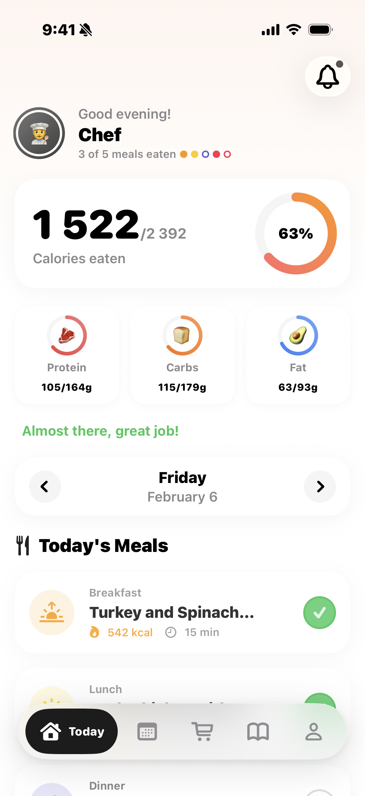
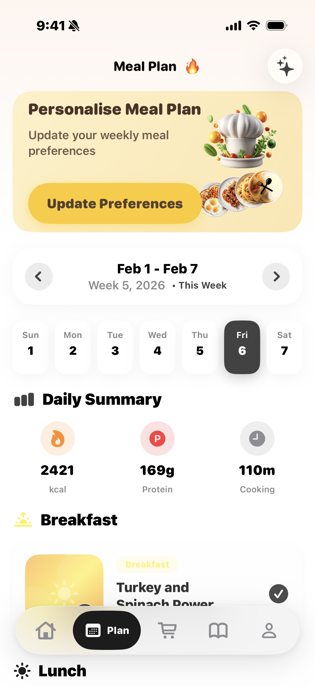
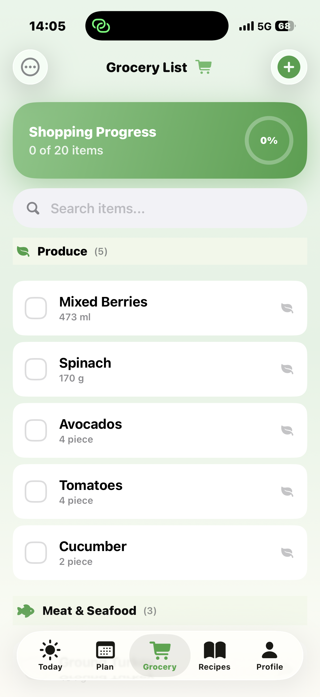
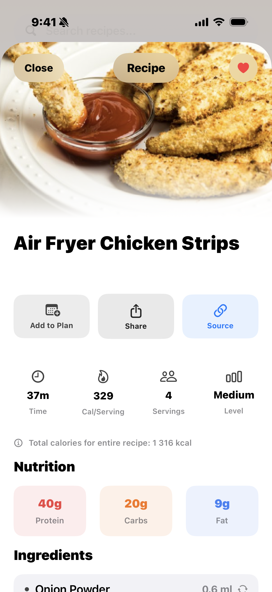
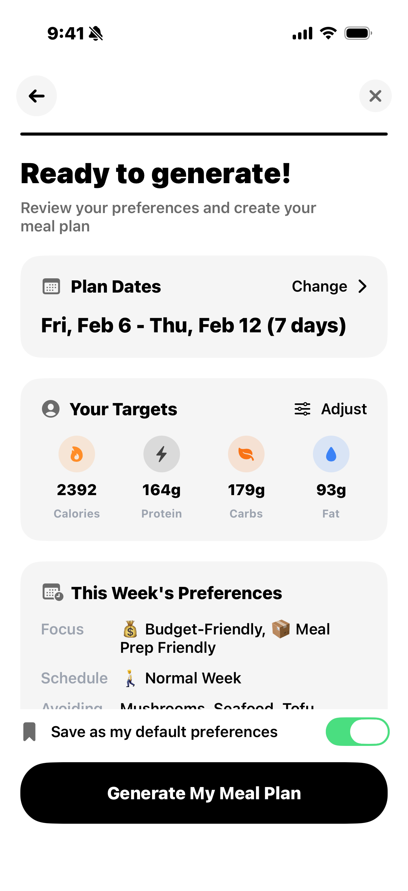

# MealPrepAI

**AI-powered meal planning for iOS — eat smarter, shop faster.**

MealPrepAI generates personalized weekly meal plans tailored to your goals, dietary needs, and taste. It builds your grocery list, tracks your nutrition, and syncs with Apple Health — all from one app.

  
  
  
  

## Features

### AI Meal Planning
- **Weekly meal plans** generated to hit your calorie and macro targets
- **AI meal swap** — replace any meal with a single tap; the AI picks a nutritionally equivalent alternative
- **Variety engine** — tracks what you've eaten recently so plans stay fresh

### Nutrition & Health
- **Calorie & macro goals** — personalized daily targets for calories, protein, carbs, and fat
- **Visual progress rings** — circular indicators for daily nutritional intake
- **Apple Health sync** — meal nutrition logged to HealthKit automatically
- **Streak tracking** — stay consistent with daily logging streaks

  
  

### Recipe Library
- **Browse by category** — breakfast, lunch, dinner, and snacks
- **Search & filter** — find recipes by cuisine, cooking time, or dietary restriction
- **Favorites** — bookmark recipes for quick access
- **Step-by-step instructions** with full ingredient lists

### Smart Grocery Lists
- **Auto-generated** from your meal plan each week
- **Unit-aware aggregation** — combines matching ingredients intelligently (no "2 cups + 150g" duplicates)
- **Organized by aisle** — produce, dairy, protein, pantry, and more
- **Check-off progress** — track items as you shop

### Personalization
- **Guided onboarding** — dietary restrictions, allergies, cuisine preferences, cooking skill
- **Flexible diets** — vegetarian, vegan, keto, paleo, gluten-free, and more
- **Custom allergies** — add any allergy, even those outside the predefined list
- **Cooking preferences** — filter by prep time and complexity

## Tech Stack

| Layer | Technology |
|---|---|
| UI | SwiftUI, MVVM with `@Observable` |
| Persistence | SwiftData (local-first, offline-ready) |
| AI Backend | Firebase Cloud Functions → Claude API |
| Health | HealthKit (nutrition sync) |
| Auth | Sign in with Apple |
| Monetization | StoreKit 2 + Superwall |
| Networking | async/await, Network Monitor for connectivity |

## Design

Premium mint-green design language featuring glass morphism cards, soft gradients, spring animations, haptic feedback, full dark mode, and accessibility support (VoiceOver + Dynamic Type).

## Requirements

- iOS 26.0+
- Xcode 26.0+
- Swift 6.0+

## License

This project is proprietary software. All rights reserved.

---

*Built with SwiftUI and powered by Claude*
